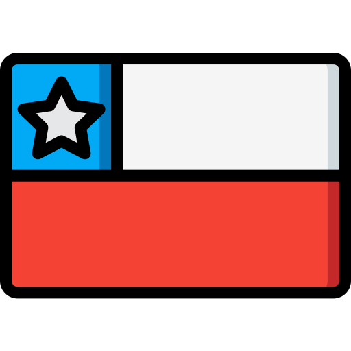
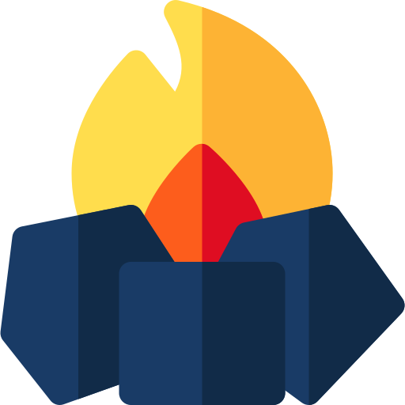
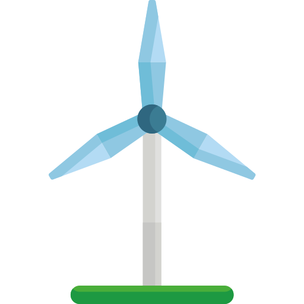
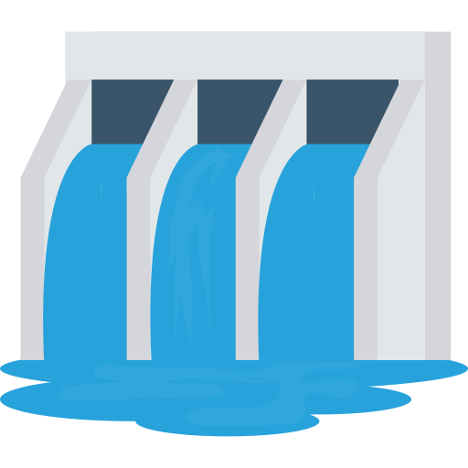

<h1>Hello </h1>

I'm Cristian Valdivia. I'm Electrical engineer and developer from  <b>Santiago, Chile.</b> 

Currently I'm CEO of <a href="https://www.ioled.cl/">iOLED.</a> We connect cannabis growers with his crop with IoT technology.

As an electrical engineer, I believe that we must fight to increase the generation of renewable energy.

<h3 align="center"> Use of energy in  Chile yesterday: 156.6 GWh</h3>
<table align="center">
  <tr>
    <td></td>
    <td></td>
    <td></td>
    <td></td>

  </tr>
  <tr>
    <td> <strong> 38.88% </strong></td>
    <td> <strong> 17.67% </strong></td>
    <td> <strong> 29.31% </strong></td>
    <td> <strong> 14.14% </strong></td>
  </tr>
</table>

 
<i >* The information is scraping from <a href="https://www.coordinador.cl/">Coodinador Eléctrico Nacional </a></i>

<h3>Some technologies that I have used to make Backend</h3>  

  
  
  
  

<h3>Some technologies that I have used to make Frontend</h3>

  
  
  
  

<h3>My favorite languages to program</h3>

  
  

<h3>Follow me</h3>

   
   

This <i>README</i> file is generated <b>every day</b>! Last refresh: Tuesday, February 2, 10:19 AM GMT-3 

